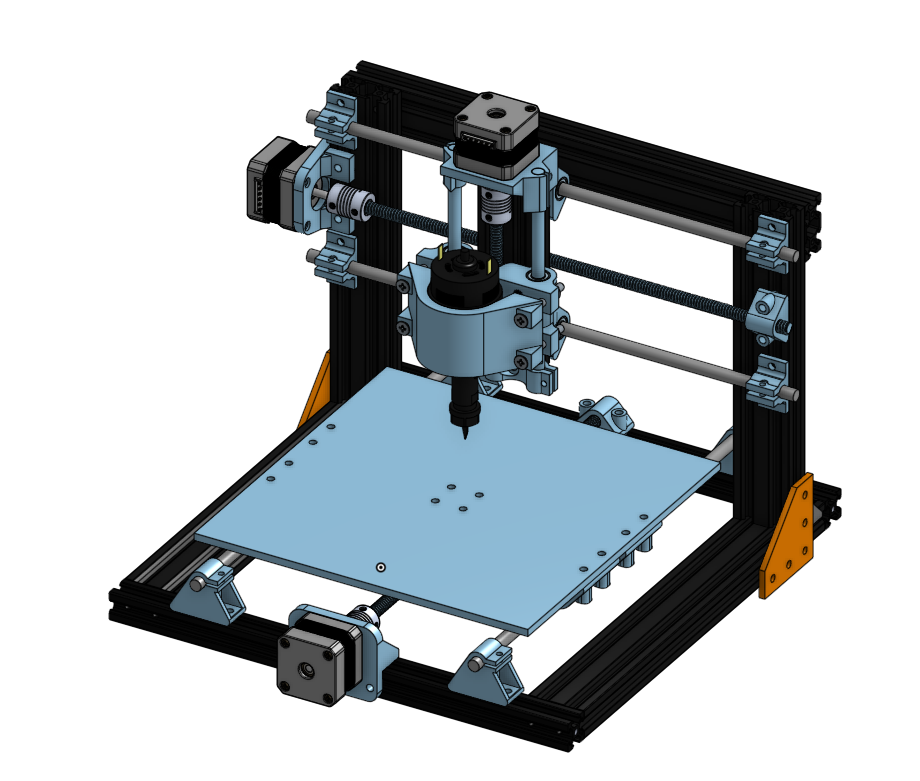
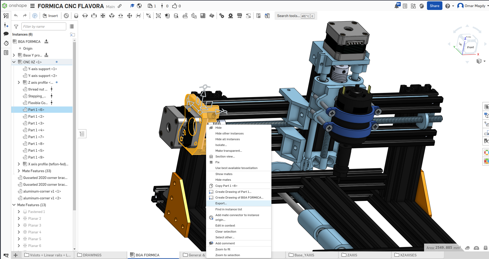

# Formica-CNC

### WHAT is this? 
A CNC (Computer Numerical Control) refers to computer control machinery where a machine and tools are controlled using programmed instructions, making the machining ( mill, lathe, drilling, etc..) automated
And this is a CNC mechanical design project

# The idea behind the name 
Formica is inspired by the Formica ants + the name sounds great

### Design Platform
# ONSHAPE
* FLAVORA repo: https://cad.onshape.com/documents/c7e4da2809577457405e03f3/w/3a8400346465e245de936de4/e/99907f46efec0cf2095235fd?renderMode=0&uiState=66ddd21bdcc2976b5f80705f
* FLAVORB repo: https://cad.onshape.com/documents/6900a50be402c55d6f40d9f6/w/fab96240f5b26f951e57d714/e/c603c618951fec65f7863fc2?renderMode=0&uiState=66ddd32cdcc2976b5f8072e6

### Aim
Provide a low-cost and simple desktop CNC solution for Hobbyists

### Perks about this design
1) low cost... By avoiding any CNC-machined parts, or high requirements machined parts and substituting that with 3d printed parts the whole design was performed for about 70$(the price may vary depending on shop prices, your country, and 3d printing cost)
2) no complex machining or high-accuracy parts are needed... all the machining you will need for this design is a (Disk/saw) for cutting aluminum extrusions and a Drilling tool
3) small and high (total size to work area) ratio
4) light.. about 6Kg total weight which means it is portable and fit for being a desktop CNC

### Materials that can be worked 
Plastics, FR4, woods (mostly soft materials)

### Use Cases
1) PCB milling/drilling
2) Label engraving
3) Artistic wood engraving 

### SubAssembly Overview PDF
[FORMICA_A_PDF](FlavorA/Main Machine assembly formica flavorA.pdf)
[FORMICA_A_PDF](FlavorB/Main Machine assembly formica flavorB.pdf)

### How to make your own 
1) Visit the Onshape repo for your desired flavor and determine the needed parts
2) Source the parts you will need to purchase (all non-light blue parts) including 2020 & 2040 aluminum extrusions, Nema17 stepper motors, Linear_Rails, 4mm Teflon(FLAVORA only), etc...
3) In addition to that determine the needed screws and nuts you will generally need (M3/ M4 /M5) screws, normal nuts, and about (30)2020 drop-in/slide-in nuts
4) You will also need to determine and buy your desired control board/Microcontroller to drive the machine (MKS-TinyBee) or any esp32-based board is recommended, and a spindle driver (a-relay or MOSFET-based switch with enough rating is sufficient), and wires
5) Export-3d printable parts in step/STL format and 3d print them 
   to export parts: select by left-clicking --> right-click to open menu --> click export
   
6) Assemble everything
7) For the firmware you can use Fluidnc(for esp32), Grbl/Marlin or any other alternative 
8) When you assemble Everything and you are all set up to actually build stuff you are going to need a CAM software and a G-code sender..

### UPCOMING 
 A high quality controller-board that is going to serve hobbyists 3d printers/CNC's

